# 				                          			CHARTE GRAPHIQUE PORTFOLIO

- [1 - Personnalisation](#id-section1)
- [- Polices](#id-section2)
- [- Couleurs](#id-section3)
- [- Logo](#id-section4)
- [2 - Contenu](#id-section5)
- [- Page d'accueil / Schéma](#id-section6)
- [- Maquette](#id-section7)
- [- Menu / Schéma](#id-section8)
- [- Maquette](#id-section9)
- [- Présentation / Schéma](#id-section10)
- [- Maquette](#id-section11)
- [- cv_schéma](#id-section12)
- [- Maquette](#id-section13)
- [- projets_schéma](#id-section14)
- [- Maquette](#id-section15)
------

#  
                                        1 - Personnalisation

## 
 - Polices

Pour ce portfolio j'ai choisi la version Extra-bold 800 de la police OpenSans :

------

## 
 - Couleurs

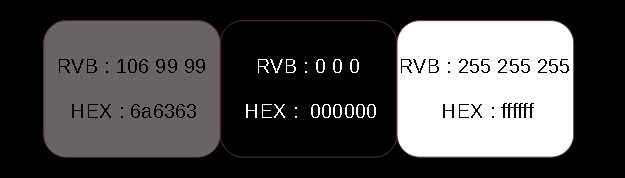

------

## 
 - Logo

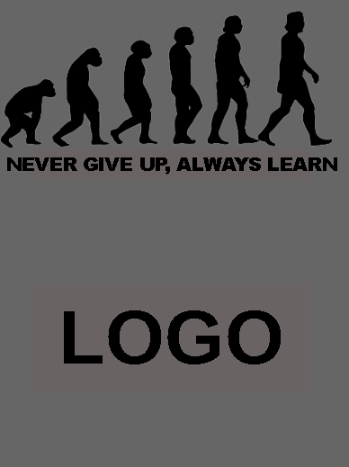

------

# 
 										2 - Contenu

- Page d'accueil / Schéma

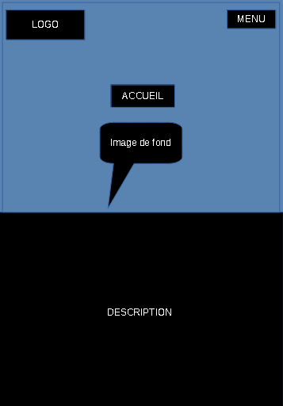

### 
 - Maquette

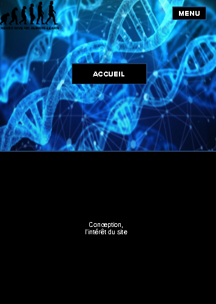

------

## 
 - Menu / Schéma

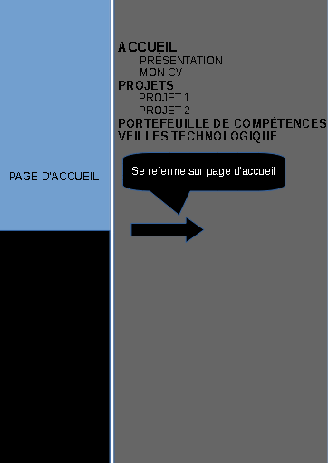

### 
 - Maquette

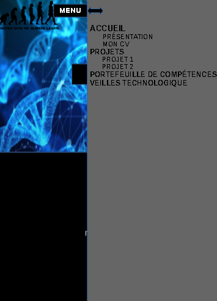

------

## 
 - Présentation / Schéma

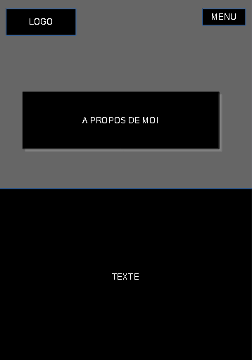

### 
 - Maquette

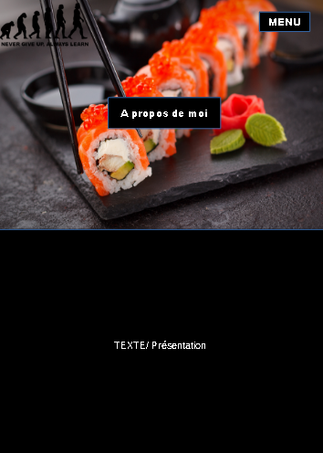

------

## 
 - CV / Schéma

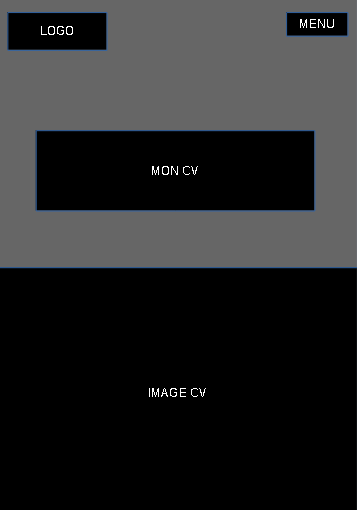

### 
 - Maquette

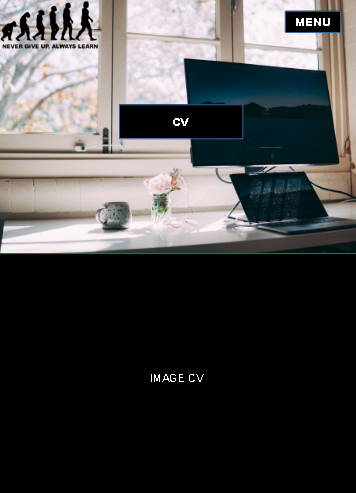

------

## 
 - Projets / Schéma

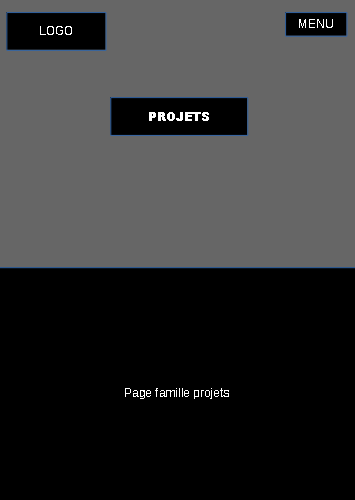

### 
 - Maquette

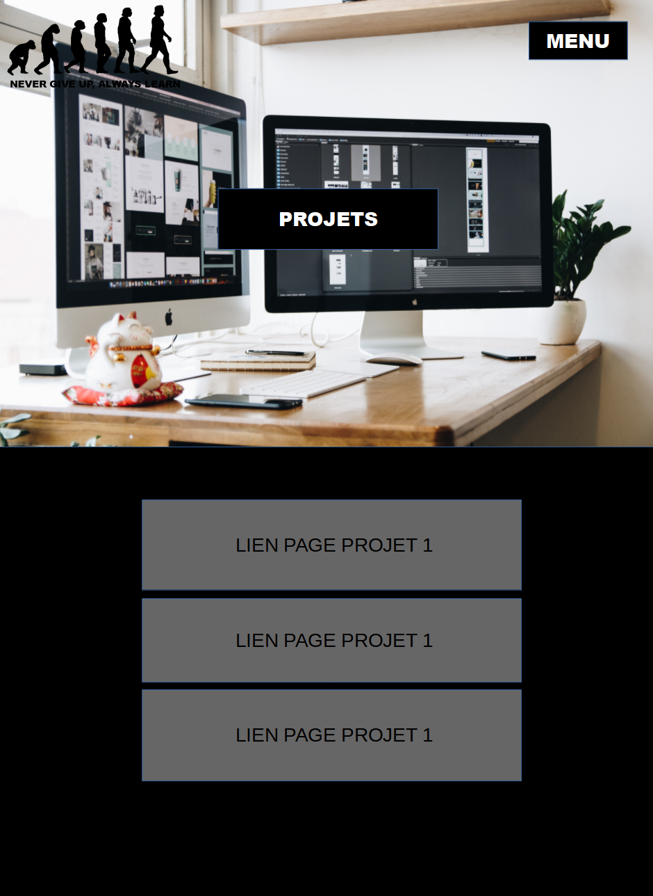

------